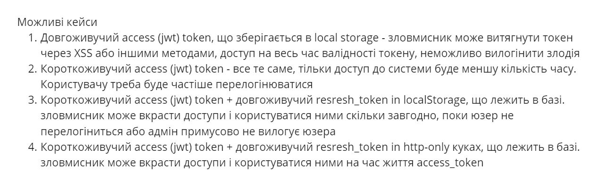

## node.js-pet-mongodb-auth

#### Plan

#### Possible cases

#### register
http://localhost:3000/auth/register
{  
    "name": "Boris",  
    "email": "boris6@mail.com",   
    "password": "123456"  
}  

#### login http://localhost:3000/auth/login
{  
    "email": "boris@mail.com",  
    "password": "123456"  
}  

{  
    "status": 200,  
    "message": "User logged in successfully!",  
    "data": {  
        "token": "XXXXXXXX"   
    }  
}  

#### http://localhost:3000/auth/refresh
  
{  
    "status": 200,  
    "message": "Token refreshed!",
    "data": {  
        "token": "XXXXXX"  
    }  
}   

#### http://localhost:3000/auth/logout

#### Get animal by id
GET http://localhost:3000/animals/:id   

Bearer "token"   

#### Get animals (pagination, sortBy, filters )
GET http://localhost:3000/animals/?page=1&limit=15&isVaccinated=0&sortBy=age&order=desc|asc&minAge=5  

Bearer "token"  

#### Create animal
POST http://localhost:3000/animals/  
{  
    "name": "Uzbechka",  
    "age": 5,  
    "isVaccinated": false,  
    "gender": "male",  
    "species": "cat"  
}

Bearer "token"  

#### Update animal
PUT http://localhost:3000/animals/:id  
{  
    "name": "AnimalToRemove"  
}  
OR  
{   
    "age": 5  
}  

Bearer "token"  

#### Soft delete animal
DELETE http://localhost:3000/animals/:id

Bearer "token"  